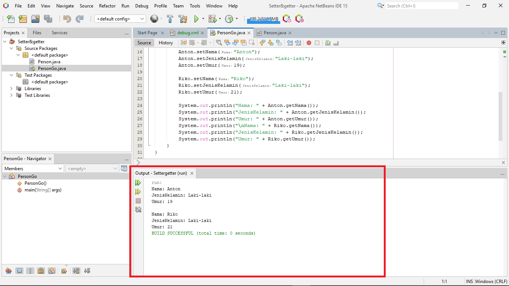

# Latihanjava2
___
### Latihan method Setter dan Getter

• Mendeklarasikan class Person, dengan atribut Nama,
JenisKelamin, Umur dengan AccesModifier
```java
public class Person {
    private String Nama;
    private String JenisKelamin;
    private Integer Umur;
    
    public void setNama(String Nama) {
        this.Nama = Nama;
    }
    public void setJenisKelamin(String JenisKelamin) {
        this.JenisKelamin = JenisKelamin;
    }
    public void setUmur(int Umur) {
        this.Umur = Umur;
    }
    // getter
    public String getNama() {
        return this.Nama;
    }
    public String getJenisKelamin() {
        return this.JenisKelamin;
    }
    public int getUmur() {
        return this.Umur;
    }
}
```
• Buatlah dua buah objek dari class Person bernama Anton
dan Riko dan Panggil method <i>Setter</i> dan <i>Getter</i>
```java
public class PersonGo {

    public static void main(String[] args) {
        Person Anton = new Person();
        Person Riko = new Person();

        Anton.setNama("Anton");
        Anton.setJenisKelamin("Laki-laki");
        Anton.setUmur(19);

        Riko.setNama("Riko");
        Riko.setJenisKelamin("Laki-laki");
        Riko.setUmur(21);

        System.out.println("Nama: " + Anton.getNama());
        System.out.println("JenisKelamin: " + Anton.getJenisKelamin());
        System.out.println("Umur: " + Anton.getUmur());
        System.out.println("\nNama: " + Riko.getNama());
        System.out.println("JenisKelamin: " + Riko.getJenisKelamin());
        System.out.println("Umur: " + Riko.getUmur());
    }
}
```
• Hasil Run
